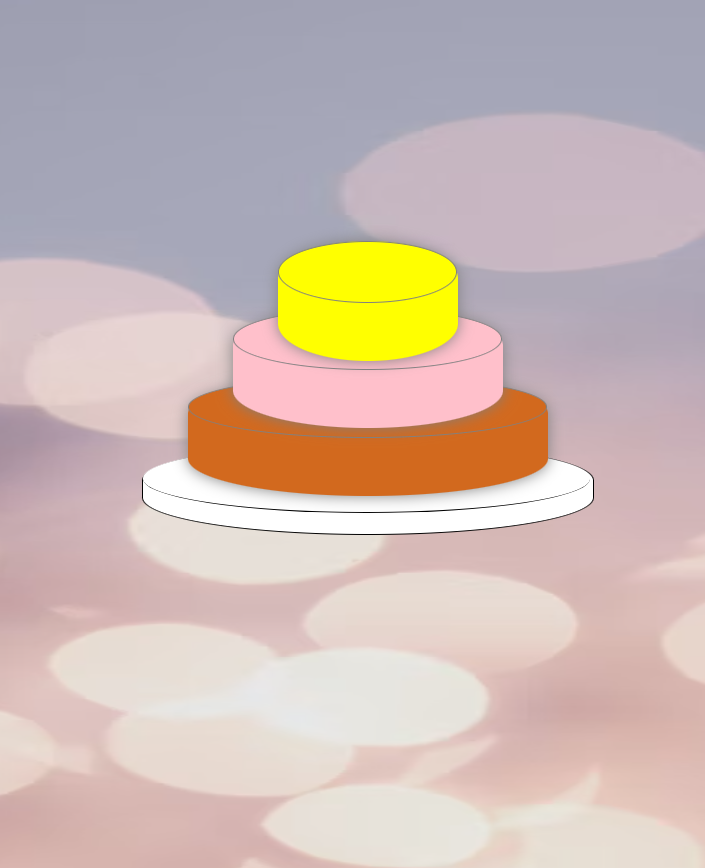
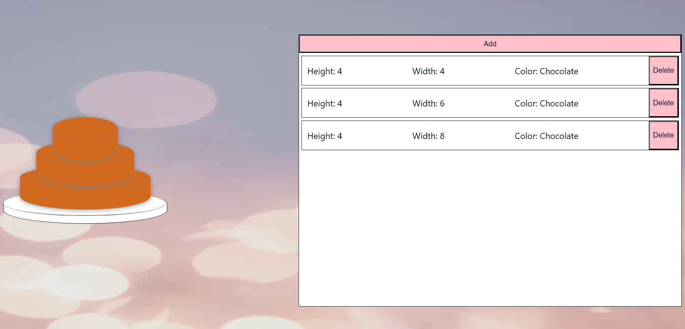

#Cake Boss :cake:

A delicious web app from [Sara](https://github.com/ssevans12), [Bailey](https://github.com/baileycytackilewis), and [Joan](https://github.com/Joan-Wolf)

##Features

- Allows the user to choose the height, width, and flavor of each layer of the cake :cupcake:
- Users can add as many layers as their hearts desire :cake:
- Delete layers you don't want :birthday:

###Technologies used

Cake Boss is built with React
